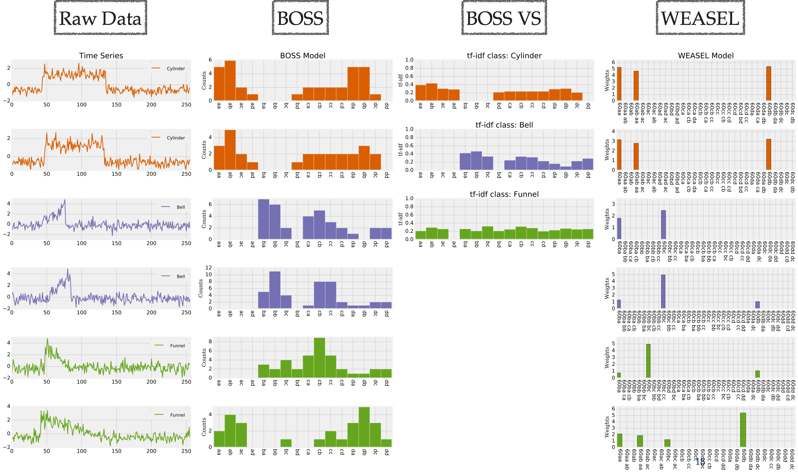
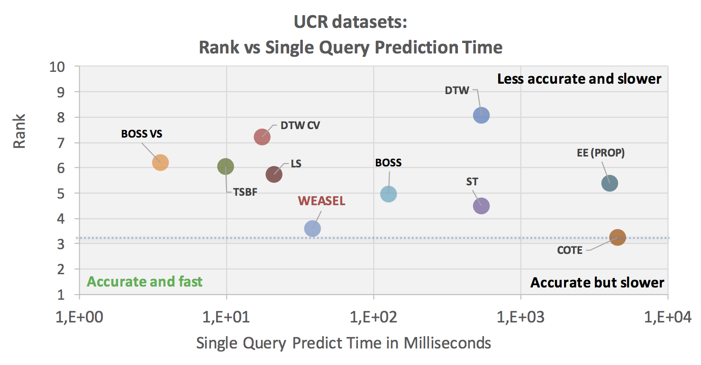
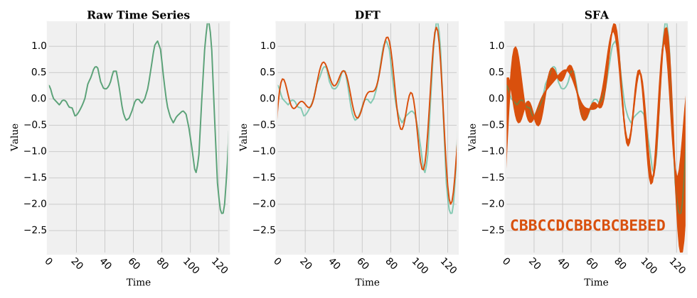

# Time Series Data Analytics

Working with time series is difficult due to the high dimensionality of the data, erroneous or extraneous data, 
and large datasets. At the core of time series data analytics there are (a) a time series representation and (b) 
a similarity measure to compare two time series. There are many desirable properties of similarity measures. 
Common similarity measures in the context of time series are Dynamic Time Warping (DTW) or the Euclidean Distance (ED). 
However, these are decades old and do not meet today’s requirements. The over-dependence of research on
the UCR time series classification benchmark has led to two pitfalls, namely: (a) they focus mostly on accuracy and (b) 
they assume pre-processed datasets. There are additional desirable properties: (a) alignment-free structural 
similarity, (b) noise-robustness, and (c) scalability.

This repository contains a symbolic time series representation (**SFA**), three univariate (**WEASEL**, **BOSS** and **BOSSVS**) and one multivariate (**WEASEL+MUSE**) time series model(s) for alignment-free, noise-robust and scalable time series data analytics. Finally, the early time series classification framework **TEASER** is provided.


The implemented algorithms are in the context of:

1. **Dimensionality Reduction**: SFA performs significantly better than many other dimensionality reduction techniques including those techniques based on mean values like SAX, PLA, PAA, or APCA. This is due the fact, that SFA builds upon DFT, which is significantly more accurate than the other dimensionality reduction techniques [[1]](http://dl.acm.org/citation.cfm?doid=2247596.2247656).

2. **Classification and Accuracy**: WEASEL and the BOSS ensemble classifier offer state-of-art classification accuracy [[2]](http://arxiv.org/abs/1602.01711), [[3]](http://link.springer.com/article/10.1007%2Fs10618-014-0377-7), [[4]](https://arxiv.org/abs/1701.07681).

3. **Classification and Scalability**: WEASEL follows the bag-of-patterns approach which achieves highly competitive classification accuracies and is very fast, making it applicable in domains with high runtime and quality constraints. The novelty of WEASEL is its carefully engineered feature space using statistical feature selection, word co-occurrences, and a supervised symbolic representation for generating discriminative words. Thereby, WEASEL assigns high weights to characteristic, variable-length substructures of a TS. In our evaluation, WEASEL is consistently among the best and fastest methods, and competitors are either at the same level of quality but much slower or faster but much worse in accuracy. [[4]](https://dl.acm.org/citation.cfm?doid=3132847.3132980).
The BOSS VS classifier is one to four orders of magnitude faster than state of the art and significantly more accurate than the 1-NN DTW classifier, which serves as the benchmark to compare to. I.e., one can solve a classification problem with 1-NN DTW CV that runs on a cluster of 4000 cores for one day, with the BOSS VS classifier using commodity hardware and a 4 core cpu within one to two days resulting in a similar or better classification accuracy [[5]](http://link.springer.com/article/10.1007%2Fs10618-015-0441-y). 

4. **Multivariate classification**: WEASEL+MUSE is a multivariate time series classifier that offers state-of-art classification accuracy [[6]](https://arxiv.org/abs/1711.11343).

5. **Early and accurate classification**: TEASER is a framework for early and accurate time series classification. The early classification task arises when data is collected over time, and it is desirable, or even required, to predict the class label of a time series as early as possible. As such, the earlier a decision can be made, the more rewarding it can be. TEASER is two to three times as early while keeping the same (or even a higher) level of accuracy, when compared to the state of the art.



Figure (second from left) shows the BOSS model as a histogram over SFA words. It first extracts subsequences (patterns) from a time series. Next, it applies low-pass filtering and quantization to the subsequences using SFA which reduces noise and allows for string matching algorithms to be applied. Two time series are then compared based on the differences in the histogram of SFA words.
 
Figure (second from right) illustrates the BOSS VS model. The BOSS VS model extends the BOSS model by a compact representation of classes instead of time series by using the term frequency - inverse document frequency (tf-idf) for each class. It significantly reduces the computational complexity and highlights characteristic SFA words by the use of the tf-idf weight matrix which provides an additional noise reducing effect.

Figure (right) illustrates the WEASEL model. WEASEL conceptually builds on the bag-of-patterns model. It derives discriminative features based on dataset labels. WEASEL extracts windows at multiple lengths and also considers the order of windows (using word co-occurrences as features) instead of considering each fixed-length window as independent feature (as in BOSS or BOSS VS). It then builds a single model from the concatenation of feature vectors. It finally applies an aggressive statistical feature selection to remove irrelevant features from each class. This resulting feature set is highly discriminative, which allows us to use fast logistic regression.

# Accuracy and Scalability



The figure shows for the state-of-the-art classifiers the total runtime on the x-axis in log scale vs the average rank on the y-axis for prediction. Runtimes include all preprocessing steps like feature extraction or selection. 

There are fast time series classifiers (BOSS VS, TSBF, LS, DTW CV) that require a few ms per prediction, but have a low average rank; and there are accurate methods (ST; BOSS; EE; COTE) that require hundredths of ms to seconds per prediction. The two ensemble methods in our comparison, EE PROP and COTE, show the highest prediction times. 

There is always a trade-off between accuracy and prediction times.  However, WEASEL is consistently among the best and fastest predicting methods, and competitors are (a) either at the same level of quality (COTE) but much slower or (b) faster but much worse in accuracy (LS, DTW CV, TSBF, or BOSS VS).


# How to include this project as a library

Step 1. Add the JitPack repository to your gradle build file:

```Gradle
	allprojects {
		repositories {
			...
			maven { url 'https://jitpack.io' }
		}
	}
```

Step 2. Add the dependency:

```Gradle
	dependencies {
	        compile 'com.github.patrickzib:SFA:v0.1'
	}
```

See  [](https://jitpack.io/#patrickzib/SFA/v0.1) for further instructions on other build systems such as maven. 

# How to import this project into your favorite IDE

You can import this project into your favorite IDE using gradle. This project has been tested with (minor versions might also work):
* Gradle >=3.5. Please refer to [GRADLE](https://gradle.org/install/#helpful-information) for further instructions on how to install gradle.
* Java JVM >=1.8
 
The project has two gradle build targets, one for IntelliJ IDEA and one for Eclipse. 

IntelliJ IDEA:
```
> gradle idea
:ideaModule
:ideaProject
:ideaWorkspace
:idea

BUILD SUCCESSFUL
```

Eclipse: 
```
> gradle eclipse
:eclipseClasspath
:eclipseJdt
:eclipseProject
:eclipse

BUILD SUCCESSFUL
```

This will create an IntelliJ IDEA or Eclipse project.

# SFA: Symbolic Fourier Approximation

The symbolic time series representation Symbolic Fourier Approximation (SFA) represents each real-valued time series by a 
string. SFA is composed of approximation using the Fourier transform and quantization using a technique called Multiple 
Coefficient Binning (MCB). Among its properties, the most notable are: (a) noise removal due to low-pass filtering and 
quantization, (b) the string representation due to quantization, and (c) the frequency domain nature of the Fourier transform. 
The frequency domain nature makes SFA unique among the symbolic time series representations. Dynamically adding or removing 
Fourier coefficients to adapt the degree of approximation is at the core of the implemented algorithms.




The figure illustrates the SFA transformation. The time series is first Fourier transformed, low-pass filtered, and then quantized to its SFA word CBBCCDCBBCBCBEBED. Higher frequency components of a signal represent rapid changes, which are often associated with noise or dropouts. By keeping the first Fourier values, the signal is smoothened, equal to a low-pass filter. Quantization builds an envelope around the Fourier transform of the time series. Since symbolic representations are essentially a character string, they can be used with string algorithms and data structures such prefix tries, bag-of-words, Markov models, or string-matching.


**Usage:**

First, train the SFA quantization using a set of samples.

```java
int wordLength = 4;	// represents the length of the resulting SFA words. typically, between 4 and 16.
int symbols = 4; 	// symbols of the discretization alphabet. 4 is the default value

// Load datasets
TimeSeries[] train = TimeSeriesLoader.loadDatset(new File("./datasets/CBF/CBF_TEST"));

// Train the SFA representation
short[][] wordsTrain = sfa.fitTransform(train, wordLength, symbols);
```

Next, transform a time series using the trained quantization bins.

```java
// Transform a times series
TimeSeries ts = ...;

// DFT approximation of the time series
double[] dftTs = sfa.transformation.transform(ts, ts.getLength(), wordLength);

// SFA quantization to an SFA word
short[] wordTs = sfa.quantization(dftTs);
```

Similarity search using the SFA distance.

```java
boolean normMean = true or false; // set to true, if mean should be set to 0 for a window

double distance = sfaDistance.getDistance(wordsTrain[t], wordTs, dftTs, normMean, minDistance);
  
// check the real distance, if the lower bounding distance is smaller than the best-so-far distance
if (distance < minDistance) {
  double realDistance = getEuclideanDistance(train[t], ts, minDistance);
  if (realDistance < minDistance) {
    minDistance = realDistance;
    best = t;
  }
}
```

Similarity search using the index SFATrie.

```java
int l = 16; 	// SFA word length ( & dimensionality of the index)
int windowLength = 256; 	// length of the subsequences to be indexed
int leafThreshold = 100; 	// number of subsequences in each leaf node
int k = 10; // k-NN search

// Load datasets
TimeSeries timeSeries = ...;
TimeSeries query = ...;

// create the SFA trie & and index the time series
SFATrie index = new SFATrie(l, leafThreshold);
index.buildIndex(timeSeries, windowLength);

// perform a k-NN search
SortedListMap<Double, Integer> result = index.searchNearestNeighbor(query, k);

```


**References**

"Schäfer, P., Högqvist, M.: SFA: a symbolic fourier approximation and index for similarity search in high dimensional datasets. In: EDBT, ACM (2012)"
[[LINK]](http://dl.acm.org/citation.cfm?doid=2247596.2247656)


# BOSS: Bag-of-SFA-Symbols

The Bag-Of-SFA-Symbols (BOSS) model combines the noise tolerance of the time series representation Symbolic Fourier 
Approximation (SFA) with the structure-based representation of the bag-of-words model which makes it inherently alignment-free. 
Apart from invariance to noise, the BOSS model provides invariances (robustness) to phase shifts, offsets, amplitudes and 
occlusions by discarding the original ordering of the SFA words and normalization. This leads to the highest classification 
and clustering accuracy in time series literature to date.

**Usage:**

First, load datasets, set parameters (or keep defaults), and train the BOSS model.

```java
// Load the train data
TimeSeries[] trainSamples = TimeSeriesLoader.loadDataset(...);

BOSSEnsembleClassifier boss = new BOSSEnsembleClassifier();
boss.minF   = 6;	// represents the minimal length for training SFA words. default: 6.
boss.maxF   = 16;	// represents the maximal length for training SFA words. default: 16.
boss.maxS   = 4; 	// symbols of the discretization alphabet. default: 4.
boss.factor = 0.92 	// the best models within this factor are kept for ensembling. default: 0.92

// train the BOSS model
Classifier.Score score = boss.fit(trainSamples);
```

Finally, predict test labels:

```java
// Load the test data
TimeSeries[] testSamples = TimeSeriesLoader.loadDataset(...);

// predict labels
Double[] labels = boss.predict(testSamples);

// predict and score
Predicions predictions = boss.score(testSamples);
```

**References**

"Schäfer, P.: The BOSS is concerned with time series classification in the presence of noise. DMKD (2015)"
[[LINK]](http://link.springer.com/article/10.1007%2Fs10618-014-0377-7)


# BOSS VS: Bag-of-SFA-Symbols in Vector Space

The BOSS in Vector Space (BOSS VS) model builds upon the BOSS model for alignment-free and noise-robust time series data 
analytics combined with the vector space model (term frequency-inverse document frequency model). It significantly reduces 
the computational complexity of the BOSS model to allow for the classifi- cation of massive time series datasets. Its moderate 
train complexity, which is lower than the test complexity of 1-NN DTW, allows for frequent model updates such as mining streaming 
data (aka real-time predictive analytics). The BOSS VS is not the most accurate classifier. However, its high speed combined 
with its good accuracy makes it unique and relevant for many practical use cases.

**Usage:**

First, load datasets, set parameters (or keep defaults), and train the BOSS VS model.

```java
// Load the train data
TimeSeries[] trainSamples = TimeSeriesLoader.loadDataset(...);

BOSSVSClassifier bossvs = new BOSSVSClassifier();
bossvs.minF   = 4;	// represents the minimal length for training SFA words. default: 4.
bossvs.maxF   = 16;	// represents the maximal length for training SFA words. default: 16.
bossvs.maxS   = 4; 	// symbols of the discretization alphabet. default: 4.
bossvs.factor = 0.95 	// the best models within this factor are kept for ensembling. default: 0.95

// train the BOSS VS model
Classifier.Score score = bossvs.fit(trainSamples);
```

Finally, predict test labels:

```java
// Load the test data
TimeSeries[] testSamples = TimeSeriesLoader.loadDataset(...);

// predict labels
Double[] labels = bossvs.predict(testSamples);

// predict and score
Predicions predictions = bossvs.score(testSamples);
```

**References**

"Schäfer, P.: Scalable Time Series Classification. DMKD (2016) and ECML/PKDD 2016
[[LINK]](http://link.springer.com/article/10.1007%2Fs10618-015-0441-y)


# WEASEL: Word ExtrAction for time SEries cLassification

The Word ExtrAction for time SEries cLassification (WEASEL) model builds upon the bag-of-pattern model. The novelty of WEASEL lies in its specific method for deriving features, resulting in a much smaller yet much more discriminative feature set. WEASEL is more accurate than the best current non-ensemble algorithms at orders-of-magnitude lower classification and training times. WEASEL derives discriminative features based on the dataset labels. WEASEL extracts windows at multiple lengths and also considers the order of windows (using word co-occurences as features) instead of considering each fixed-length window as independent feature. It then builds a single model from the concatenation of feature vectors. So, instead of training O(n) different models, and picking the best one, we weigh each feature based on its relevance to predict the class. Finally, WEASEL applies an aggressive statistical feature selection to remove irrelevant features from each class, without negatively impacting accuracy and heavily reducing runtime. 

**Usage:**

First, load datasets, set parameters (or keep defaults), and train the WEASEL model.

```java
// Load the train data
TimeSeries[] trainSamples = TimeSeriesLoader.loadDataset(...);

WEASELClassifier weasel = new WEASELClassifier();
weasel.minF   = 4;	// represents the minimal length for training SFA words. default: 4.
weasel.maxF   = 6;	// represents the maximal length for training SFA words. default: 6.
weasel.maxS   = 4; 	// symbols of the discretization alphabet. default: 4.

// train the BOSS VS model
Classifier.Score score = weasel.fit(trainSamples);
```

Finally, predict test labels:

```java
// Load the test data
TimeSeries[] testSamples = TimeSeriesLoader.loadDataset(...);

// predict labels
Double[] labels = weasel.predict(testSamples);

// predict and score
Predicions predictions = weasel.score(testSamples);
```


**References**

"Schäfer, P., Leser, U.: Fast and Accurate Time Series Classification with WEASEL."
CIKM 2017, (accepted), [[LINK arXiv]](https://arxiv.org/abs/1701.07681), [[LINK ACM]](https://dl.acm.org/citation.cfm?doid=3132847.3132980)


# WEASEL+MUSE: WEASEL + MUltivariate Symbolic Extension


WEASEL+MUSE is an extension of the univariate WEASEL classifier to allow for
multivariate time series classification. We observed that WEASEL tends to overfit for multivariate time series due to their high dimensionality. Thus, WEASEL+MUSE makes use of the unsupervised symbolic representation SFA, which generates words irrelevant of the labels, and adds derivatives to each sensor stream of the multivariate time series. To distinguish between the sensor streams, their identifiers are appended to each word.

In our experimental evaluation on 20 public multivariate datasets [[LINK]](http://www.mustafabaydogan.com/multivariate-time-series-discretization-for-classification.html) and a challenge on motion capture data [[LINK]](https://aaltd16.irisa.fr/challenge/), WEASEL+MUSE is constantly among the most accurate methods, when compared to state-of-the-art multivariate classifiers, and performs best for motion sensor data, followed by speech or hand-written letter recognition tasks.

**Usage:**

First, load datasets, set parameters (or keep defaults), and train the WEASEL+MUSE model.

```java
// Load the train data
boolean useDerivatives = true;
MultiVariateTimeSeries[] trainSamples = TimeSeriesLoader.loadMultivariateDatset(..., useDerivatives);

MUSEClassifier muse = new MUSEClassifier();
weasel.minF   = 4;	// represents the minimal length for training SFA words. default: 4.
weasel.maxF   = 6;	// represents the maximal length for training SFA words. default: 6.
weasel.maxS   = 4; 	// symbols of the discretization alphabet. default: 4.
SFA.HistogramType[] histTypes = ...; // the binning method(s) to use for discretization


// train the BOSS VS model
Classifier.Score score = muse.fit(trainSamples);
```

Finally, predict test labels:

```java
// Load the test data
MultiVariateTimeSeries[] testSamples = TimeSeriesLoader.loadMultivariateDatset(...,useDerivatives);

// predict labels
Double[] labels = muse.predict(testSamples);

// predict and score
Predicions predictions = muse.score(testSamples);
```


**References**

"Schäfer, P., Leser, U.: Multivariate Time Series Classification with WEASEL+MUSE."
arXiv 2017, [[LINK]](https://arxiv.org/abs/1711.11343)


# Multivariate Dataset format

The multivariate dataset format is based on [Multivariate Time Series Classification Datasets](http://www.mustafabaydogan.com/files/viewdownload/14-multivariate-time-series-classification/29-multivariate-time-series-classification-datasets.html).

The first column is the sample id, the second column is the time stamp of the observations, the **third column is the label** for the sample (and it may not change for the same sample id), the last columns are the observations (different dimensions of the multivariate time series).

An example:

|Sample Id|Time Stamp|Class |Pressure|Temperature|Energy|
|------|-----------|------|---------|------------|-------|
|1 |1|1|2.70|80.50|4.50|
|1|2|1|3.20|78.40|6.70|
|1|3|1|4.20|67.90|3.40|
|1|4|1|8.20|89.50|7.20|
|1|5|1|8.90|85.70|5.70|
|2|1|3|16.34|97.54|5.02|
|2|2|3|17.61|99.66|5.01|
|2|3|3|18.87|101.60|4.90|
|2|4|3|20.14|103.54|4.95|
|2|5|3|22.67|107.43|4.95|
|2|6|3|21.15|106.50|4.97|
|..|..|..|..|..|..|
|N|1|0|8.90|85.70|5.70|
|N|2|0|10.01|88.00|5.05|
|N|3|0|11.28|89.94|5.04|
 

# TEASER: Two-Tier Early and Accurate Series classifiER (TEASER)


In many applications measurements arrive over time and the collection of additional measurements is associated with a cost, or it is critical to act as early as possible. In this context, it is desirable to have a high-quality classification as soon as possible, while sacrificing as little accuracy as possible. The state-of-the-art methods in early time series classification compute an optimal decision time from the train time series. However, this approach assumes that a time series has a defined start (like turning on a machine), whereas in many applications measurements start at arbitrary times in an essentially infinite time series (like heartbeats in a patient). 

TEASER is a method for early and accurate time series classification. TEASER’s decision for the safety (accuracy) of a prediction is treated as a two-stage classification problem: A slave classifier continuously classifies the time series, and a master classifier decides whether this result should be trusted or not.

In our experimental evaluation using a benchmark of time series datasets [[LINK]](http://www.cs.ucr.edu/~eamonn/time_series_data/), TEASER is two to three times as early while keeping the same (or even a higher) level of accuracy, when compared to the state of the art. 


**Usage:**

First, load datasets, set parameters (or keep defaults), and train the TEASER model.

```java
// Load the train/test splits
TimeSeries[] trainSamples = TimeSeriesLoader.loadDataset(train);

// The TEASER-classifier
TEASERClassifier t = new TEASERClassifier();

/* The total number of time stamps S: a time stamp is a fraction of the full time series 
length n. S is typically a constant set to 20, such that a prediction will be made after 
every 5% of the full time series length. */
TEASERClassifier.S = 20.0;

Classifier.Score scoreT = t.fit(trainSamples);

```

Finally, predict test labels:

```java
TimeSeries[] testSamples = TimeSeriesLoader.loadDataset(test);

// Predict labels
Double[] pred = t.predict(testSamples);

// Alternatively predict labels and obtain offsets
OffsetPrediction offsetPred = t.predict(testSamples, true);

```


**References**

"Schäfer, P., Leser, U.: TEASER: Early and Accurate Time Series Classification." arXiv 2019, [[LINK]](https://arxiv.org/pdf/1908.03405)


# Use Cases / Tests

There are 7 implemented use cases:


1. Classification accuracy of WEASEL, BOSS VS and BOSS ensemble on the UCR datasets: [UCRClassificationTest.java](https://github.com/patrickzib/SFA/blob/master/src/test/java/sfa/UCRClassificationTest.java)
2. SFA lower bounding distance to the Euclidean distance: 
[SFAMinDistanceTest.java](https://github.com/patrickzib/SFA/blob/master/src/test/java/sfa/SFAMinDistanceTest.java)
3. Generate SFA words from a set of samples: 
[SFAWordsTest.java](https://github.com/patrickzib/SFA/blob/master/src/test/java/sfa/SFAWordsTest.java)
4. SFA makes use of variable word lengths: 
[SFAWordsVariableLengthTest.java](https://github.com/patrickzib/SFA/blob/master/src/test/java/sfa/SFAWordsVariableLengthTest.java)
5. Extract sliding windows from a time series and transform each sliding window to its SFA word: 
[SFAWordsWindowingTest.java](https://github.com/patrickzib/SFA/blob/master/src/test/java/sfa/SFAWordsWindowingTest.java)
6. Time series indexing and similarity search: 
[SFATrieTest.java](https://github.com/patrickzib/SFA/blob/master/src/test/java/sfa/SFATrieTest.java)
7. Time series bulk loading and similarity search: 
[SFABulkLoadTest.java](https://github.com/patrickzib/SFA/blob/master/src/test/java/sfa/SFABulkLoadTest.java)

# Alternative Implementations

1) Scikit-Learn Python-Package: Thanks Johann Faouzi (ICM, Brain & Spine Institute) there is a scikit-learn python-package for WEASEL, BOSS, BOSS VS, SFA (and others), based on the scikit-learn framework.
[Python + Scikit-Learn](https://github.com/johannfaouzi/pyts)


2) Python: Thanks to Samuel Harford, Houshang Darabi (University of Illinois at Chicago) there is a python port of this code available.
[Python port](https://github.com/sharford5/SFA_Python)

3) JAVA:  The UEA & UCR Time Series Classification Repository provides an alternative implementation of BOSS as well as other state-of-the-art classifiers.
[Time Series Classification Repository](http://timeseriesclassification.com/code.php)

# References & Acknowledgements

This work is supported by the [ZIB (Zuse Institute Berlin)](http://www.zib.de/en/home.html) and [HU Berlin (Humboldt-Universität zu Berlin)](http://www.hu-berlin.de).

Read more about Scalable Time Series Data Analytics in the [Dissertation](http://edoc.hu-berlin.de/docviews/abstract.php?id=42117).

[The UCR Time Series Classification Archive](http://www.cs.ucr.edu/~eamonn/time_series_data/)

[The Great Time Series Classification Bake Off: An Experimental Evaluation of Recently Proposed Algorithms. Extended Version](http://arxiv.org/abs/1602.01711)

Many thanks to @ChristianSch for porting the project to gradle, and to @mohataher for providing save/load functionality as well as JUNIT tests.

