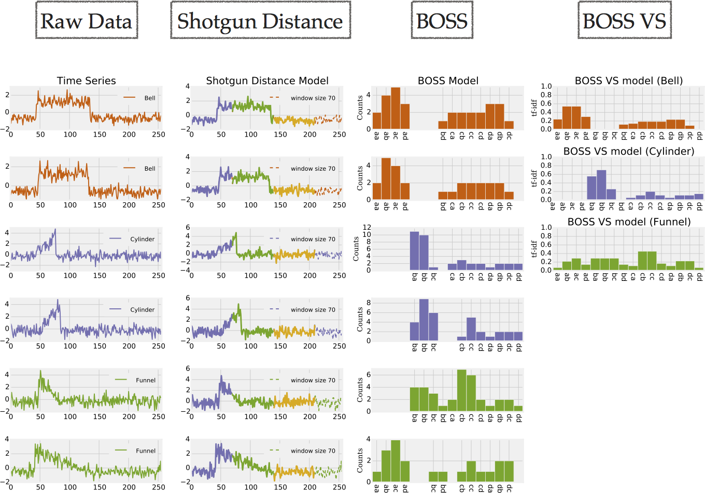

# Time Series Data Analytics

Working with time series is difficult due to the high dimensionality of the data, erroneous or extraneous data, 
and large datasets. At the core of time series data analytics there are (a) a time series representation and (b) 
a similarity measure to compare two time series. There are many desirable properties of similarity measures. 
Common similarity measures in the context of time series are Dynamic Time Warping (DTW) or the Euclidean Distance (ED). 
However, these are decades old and do not meet today’s requirements. The over-dependance of research on 
the UCR time series classification benchmark has led to two pitfalls, namely: (a) they focus mostly on accuracy and (b) 
they assume pre-processed datasets. There are additional desirable properties: (a) alignment-free structural 
similarity, (b) noise-robustness, and (c) scalability.

This repository contains a symbolic time series representation (**SFA**) and two time series models (**BOSS** and **BOSSVS**) for alignment-free, noise-robust and scalable time series data analytics. 

The implemented algorithms are in the context of:

1. **Dimensionality Reduction**: SFA performs significantly better than many other dimensionality reduction techniques including those techniques based on mean values like SAX, PLA, PAA, or APCA. This is due the fact, that SFA builds upon DFT, which is significantly more accurate than the other dimensionality reduction techniques [[1]](http://dl.acm.org/citation.cfm?doid=2247596.2247656).

2. **Classification and Accuracy**: The BOSS ensemble classifier offers state of art classification accuracy [[2]](http://arxiv.org/abs/1602.01711), [[3]](http://link.springer.com/article/10.1007%2Fs10618-014-0377-7).

3. **Classification and Scalability**: The BOSS VS classifier is one to four orders of magnitude faster than state of the art and significantly more accurate than the 1-NN DTW classifier, which serves as the benchmark to compare to. I.e., one can solve a classification problem with 1-NN DTW CV that runs on a cluster of 4000 cores for one day, with the BOSS VS classifier using commodity hardware and a 4 core cpu within one to two days resulting in a similar or better classification accuracy [[4]](http://link.springer.com/article/10.1007%2Fs10618-015-0441-y).



Figure (center) shows the BOSS model as a histogram over SFA words. It first extracts subsequences (patterns) from a time series. Next, it applies low-pass filtering and quantization to the subsequences using SFA which reduces noise and allows for string matching algorithms to be applied. Two time series are then compared based on the differences in the histogram of SFA words.
 
Figure (right) illustrates the BOSS VS model. The BOSS VS model extends the BOSS model by a compact representation of classes instead of time series by using the term frequency - inverse document frequency (tf-idf) for each class. It significantly reduces the computational complexity and highlights characteristic SFA words by the use of the tf-idf weight matrix which provides an additional noise reducing effect.


# SFA: Symbolic Fourier Approximation

The symbolic time series representation Symbolic Fourier Approximation (SFA) represents each real-valued time series by a 
string. SFA is composed of approximation using the Fourier transform and quantization using a technique called Multiple 
Coefficient Binning (MCB). Among its properties, the most notable are: (a) noise removal due to low-pass filtering and 
quantization, (b) the string representation due to quantization, and (c) the frequency domain nature of the Fourier transform. 
The frequency domain nature makes SFA unique among the symbolic time series representations. Dynamically adding or removing 
Fourier coefficients to adapt the degree of approximation is at the core of the implemented algorithms.


 
**Usage:**

First, train the SFA quantization using a set of samples.

```java
// Load datasets
TimeSeries[] train = TimeSeriesLoader.loadDatset(new File("./datasets/CBF/CBF_TEST"));

// Train the SFA representation
short[][] wordsTrain = sfa.fitTransform(train, wordLength, symbols);
```

Next, transform a time series using the trained quantization bins.

```java
// Transform a times series
TimeSeries ts = ...;

// DFT approximation of the time series
double[] dftTs = sfa.transformation.transform(ts, ts.getLength(), wordLength);

// SFA quantization to an SFA word
short[] wordTs = sfa.quantization(dftTs);
```

Similarity search using the SFA distance.

```java
double distance = sfaDistance.getDistance(wordsTrain[t], wordTs, dftTs, normMean, minDistance);
  
// check the real distance, if the lower bounding distance is smaller than the best-so-far distance
if (distance < minDistance) {          
  double realDistance = getEuclideanDistance(train[t], ts, minDistance);
  if (realDistance < minDistance) {
    minDistance = realDistance;
    best = t;
  }     
}
```
	
**References**

"Schäfer, P., Högqvist, M.: SFA: a symbolic fourier approximation and index for similarity search in high dimensional datasets. In: EDBT, ACM (2012)"
http://dl.acm.org/citation.cfm?doid=2247596.2247656


# BOSS: Bag-of-SFA-Symbols

The Bag-Of-SFA-Symbols (BOSS) model combines the noise tolerance of the time series representation Symbolic Fourier 
Approximation (SFA) with the structure-based representation of the bag-of-words model which makes it inherently alignment-free. 
Apart from invariance to noise, the BOSS model provides invariances (robustness) to phase shifts, offsets, amplitudes and 
occlusions by discarding the original ordering of the SFA words and normalization. This leads to the highest classification 
and clustering accuracy in time series literature to date.

**Usage:**

First, to train the BOSS model using a set of samples, we first have to obtain the SFA words:

```java
TimeSeries[] trainSamples = ...

BOSSVSModel model = new BOSSVSModel(maxF, maxS, score.windowLength, normMean);              
int[][] words = model.createWords(trainSamples);
```

Next, we build a histogram of word frequencies (bag-of-patterns):

```java
BagOfPattern[] bag = model.createBagOfPattern(words, trainSamples, wordLength);
```

**References**

"Schäfer, P.: The BOSS is concerned with time series classification in the presence of noise. DMKD 29(6) (2015) 1505–1530"
http://link.springer.com/article/10.1007%2Fs10618-014-0377-7


# BOSS VS: Bag-of-SFA-Symbols in Vector Space

The BOSS in Vector Space (BOSS VS) model builds upon the BOSS model for alignment-free and noise-robust time series data 
analytics combined with the vector space model (term frequency-inverse document frequency model). It significantly reduces 
the computational complexity of the BOSS model to allow for the classifi- cation of massive time series datasets. Its moderate 
train complexity, which is lower than the test complexity of 1-NN DTW, allows for frequent model updates such as mining streaming 
data (aka real-time predictive analytics). The BOSS VS is not the most accurate classifier. However, its high speed combined 
with its good accuracy makes it unique and relevant for many practical use cases.

**Usage:**

First, to train the BOSS VS model using a set of samples, we first have to obtain the SFA words:

```java
TimeSeries[] trainSamples = ...

BOSSVSModel model = new BOSSVSModel(maxF, maxS, score.windowLength, normMean);              
int[][] words = model.createWords(trainSamples);
```

Next, we build a histogram of word frequencies (bag-of-patterns):

```java
BagOfPattern[] bag = model.createBagOfPattern(words, trainSamples, wordLength);
```

Finally, we build obtain the tf-idf model from the bag-of-patterns for each class label (uniqueLabels):

```java
ObjectObjectOpenHashMap<String, IntFloatOpenHashMap> idf = model.createTfIdf(bag, uniqueLabels);
```

**References**

"The Bag-of-SFA-Symbols in Vector Space classifier as published in Schäfer, P.: Scalable time series classification. DMKD (Preprint)"
http://link.springer.com/article/10.1007%2Fs10618-015-0441-y

# Use Cases / Tests

There are 5 implemented use cases:

1. Classification accuracy of BOSS VS and BOSS ensemble on the UCR datasets: UCRClassification.java
2. SFA lower bounding distance to the Euclidean distance: SFAMinDistance.java
3. Generate SFA words from a set of samples: SFAWords.java
4. SFA makes use of variable word lengths: SFAWordsVariableLength.java
5. Extract sliding windows from a time series and transform each sliding window to its SFA word: SFAWordsWindowing.java

# Acknowledgements

This work is supported by the [ZIB (Zuse Institute Berlin)](http://www.zib.de/en/home.html).

Read more about Scalable Time Series Data Analytics in the [Dissertation](http://edoc.hu-berlin.de/docviews/abstract.php?id=42117).

The UCR Time Series Classification Archive can be downloaded from:
http://www.cs.ucr.edu/~eamonn/time_series_data/
